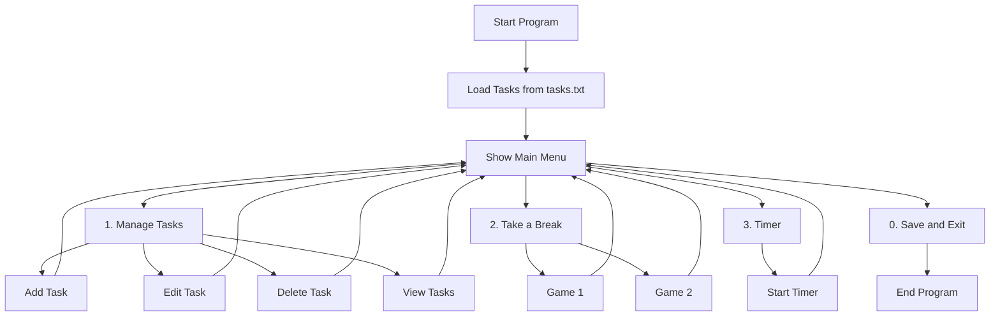
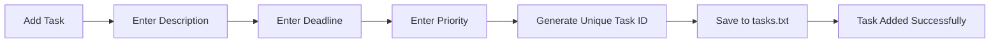
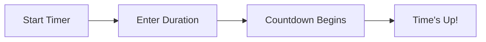
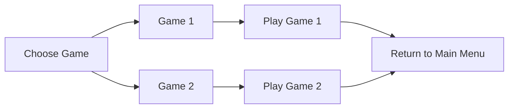

# Time Management System (C++)

A **menu-based Time Management System** built in C++ that helps users manage tasks, take breaks with games, and use a timer. The system stores tasks in a text file and provides options to add, edit, delete, and view tasks.

---

## Key Features

- **Task Management**
  - Add, edit, delete, and view tasks.
  - Tasks include a description, deadline, and priority level (1–5).
  - Tasks are stored in `tasks.txt`.

- **Break Games**
  - Includes simple games to help users take a break.

- **Timer**
  - A countdown timer for productivity sessions.

- **User-Friendly Menu**
  - Intuitive menu-based navigation for all features.

---

## Program Workflow



---

## How to Run

1. **Compile the Code**
   ```bash
   g++ main.cpp -o time_management
   ```

2. **Run the Executable**
   ```bash
   ./time_management
   ```

---

## Example Console Output

```plaintext
~~~~~~~~~~~~~~~~~~~~~~~~~~~~
~  TIME MANAGEMENT SYSTEM  ~
~~~~~~~~~~~~~~~~~~~~~~~~~~~~
1. Tasks
2. Take a little break
3. Timer
0. Save and Exit
~~~~~~~~~~~~~~~~~~~~~~~~~~~~
Enter your choice: 
```

---

## Data File Structure

### tasks.txt:
```makefile
ID: 1
Description: Complete project report
Deadline: 2025-12-01
Priority: 5
--------------------------------------------------
```

---

## Detailed Features

### Task Management
- **Add Task**: Users can add tasks with a description, deadline, and priority level.
- **Edit Task**: Modify existing tasks by updating their details.
- **Delete Task**: Remove tasks by their unique ID.
- **View Tasks**: Display all tasks in a structured format.

### Break Games
- **Game 1**: A simple game to refresh the mind.
- **Game 2**: Another engaging game for relaxation.

### Timer
- Set a countdown timer for productivity sessions.
- Helps users focus on tasks for a set duration.

---

## Program Logic

### Task Management Logic


### Timer Logic


### Break Games Logic


---

## Menu Overview

```plaintext
1. Manage Tasks
2. Take a Break
3. Timer
0. Save and Exit
```

---

## Example Task Addition

```plaintext
Enter task description: Complete project report
Enter deadline: 2025-12-01
Enter priority [1-5]: 5
Task added successfully!
```

---

## Future Improvements

- Add more games for breaks.
- Enhance the task management system with categories and reminders.
- Implement a graphical user interface (GUI).
- Add support for recurring tasks and notifications.
- Integrate with calendar applications for better scheduling.

---

## Quick Info

The <ins>project</ins> is done by ***Shokhjakhon Toshpolatov*** as part of a learning exercise for C++ programming. It demonstrates the use of file handling, classes, and menu-driven programs. The project was completed on **November 27, 2025**.
